<div align="center">



<br>


**Small businesses run on processes nobody ever wrote down.**
FlowOps watches the work that is already happening — in chat, in tasks, in who waits on whom —
and hands back the process that was always there.

</div>

---

<div align="center">

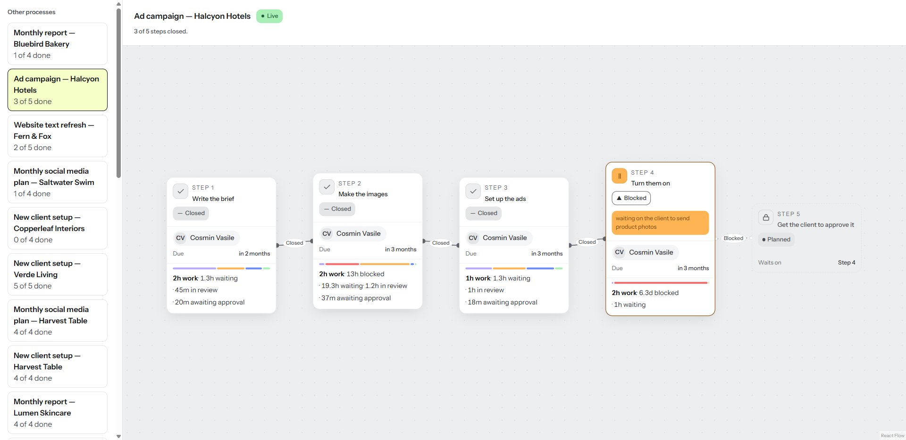

<sub><b>A live process run.</b> Five steps, the dependency edges between them, where every hour actually went, and step 4 blocked — with the reason a person typed, not a status code.</sub>

</div>

---

<details>
<summary><b>Contents</b></summary>

- [The problem](#the-problem)
- [The idea — the bracket model](#the-idea--the-bracket-model)
- [A walk through the product](#a-walk-through-the-product)
- [Architecture](#architecture)
- [The data model](#the-data-model)
- [The analysis pipeline](#the-analysis-pipeline)
- [The local model integration](#the-local-model-integration)
- [The API surface](#the-api-surface)
- [Testing and the merge gates](#testing-and-the-merge-gates)
- [Technical decisions, and what they cost](#technical-decisions-and-what-they-cost)
- [Running it](#running-it)
- [Repository layout](#repository-layout)
- [The stack, in full](#the-stack-in-full)

</details>

---

## The problem

A twelve-person marketing studio has processes. Nobody has written any of them down.

The process for onboarding a client lives in the head of whoever did it last. The reason the December
campaign slipped two weeks lives in a chat thread nobody will read again. When somebody leaves, the
process leaves with them — and the replacement rebuilds it by making the same mistakes.

Process-mining tools exist for this, and they want an event log a small business does not have. They
assume an ERP, a ticketing system, a discipline of recording. A studio of twelve has chat messages
and good intentions.

**FlowOps starts from what actually exists.** Somebody taps a circle beside a message in a chat, and
that is the entire act of recording. Everything else is derived.

---

## The idea — the bracket model

<div align="center">
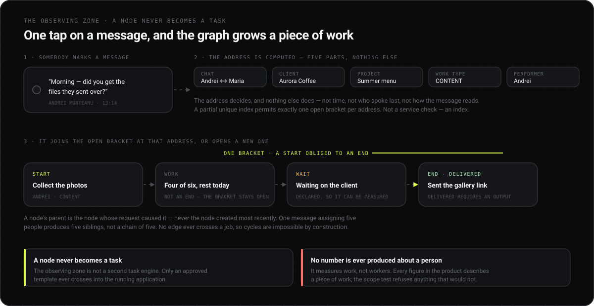
</div>

A mark does not create a task. It computes a **five-part address** —
`(chat, client, project, work_type, performer)` — and then does exactly one of two things: joins the
open bracket already at that address, or opens a new one.

A **bracket** is a START node obliged to an END. Between them sit ordinary work nodes and declared
waits. It closes one of three ways a person chooses, and each demands something different:

| End kind | What it means | What it demands |
|---|---|---|
| `DELIVERED` | Something left the building | An output — a link, a file, an address |
| `DONE` | Finished, nothing to hand over | Nothing |
| `DROPPED` | Abandoned on purpose | A reason, in words |

Six further closures exist for the cases a person did not choose — `LAPSED`, `PARENT_CLOSED`,
`MERGED`, `HANDED_OVER`, `CADENCE_CLOSED`, `OVERRIDE` — and the enum knows the difference:

```java
public boolean countsAsPatternEvidence() {
    return this == DELIVERED || this == DONE || this == DROPPED;
}

public boolean leavesAHole() {
    return this == LAPSED || this == PARENT_CLOSED;
}
```

A bracket that lapsed is not evidence of how the business works. It is evidence that somebody stopped
answering. Folding the two together would teach the analyser a shape nobody ever performed.

<details>
<summary><b>Four rules that look like details and are not</b></summary>

**The address decides, and nothing else does.** Not time, not who spoke last, not how the message
reads. Exactly one open bracket per address is enforced by a **partial unique index**, not a service
check — because a service check loses the race and an index does not.

**A node's parent is the node whose request caused it, never the node created most recently.** One
message assigning five people produces five siblings, not a chain of five. The chain version looks
right on a canvas and is a different process.

**No edge ever crosses a job.** Cycles are therefore impossible by construction rather than by
validation, which means there is no cycle check to forget.

**A partial delivery is not an end.** *"Four of the six, the rest tomorrow"* is an ordinary work node
and the bracket stays open. The three end kinds need no fourth, and the closing prompt is always
skippable — because *not yet* is a real answer, and a product that will not accept it collects
lies.

</details>

<div align="center">
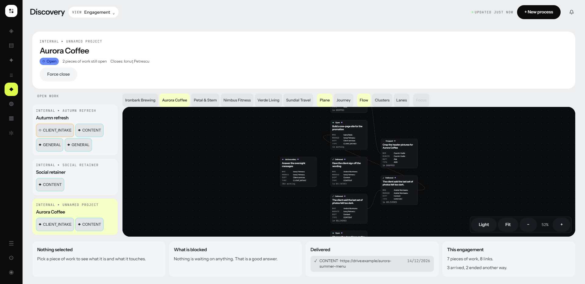
<br>
<sub><b>The graph that results.</b> Seven pieces of work, eight links. Every node carries who performed it, who marked it, which department and work type it belongs to, and how long it has been in its current state — <code>28d working</code>, <code>1m DELIVERED</code>.</sub>
</div>

---

## A walk through the product

<details open>
<summary><b>1 · It starts in the chat</b></summary>

<br>

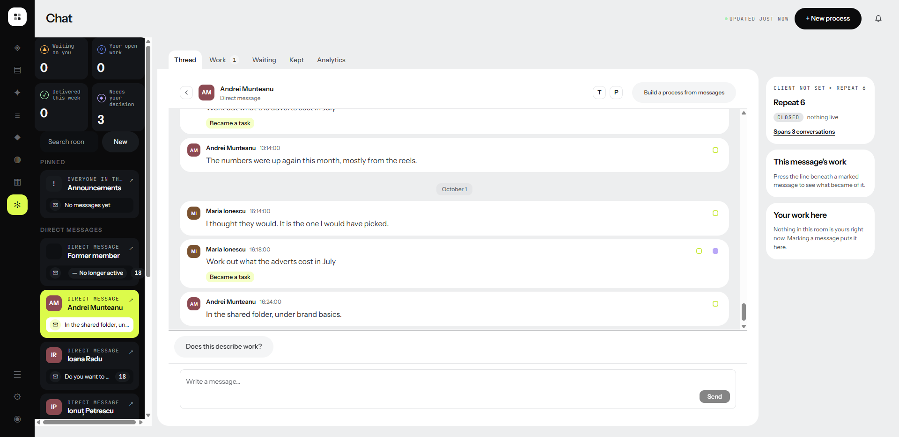

Two messages in this thread have already **become tasks**. The right-hand panel has noticed something
more interesting: this shape is `Repeat 6`, and it **spans 3 conversations** — the same work, done six
times, discussed in three different places by people who never noticed they were repeating themselves.

`Build a process from messages` is the button that turns that observation into a draft.

</details>

<details>
<summary><b>2 · Work becomes a record, not a row</b></summary>

<br>

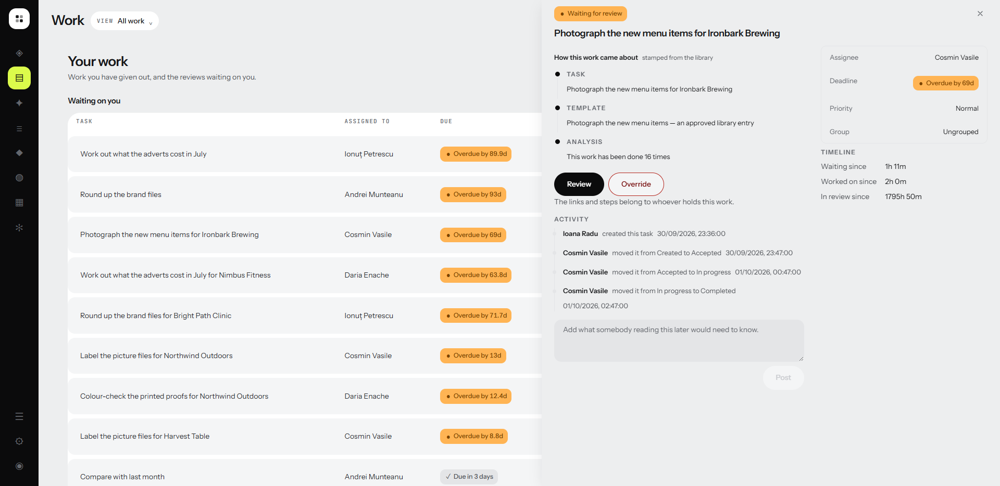

The task is the analytical core of the product, so it is modelled as structured data rather than a
title and a status. This record knows:

- **Where it came from** — this task, stamped from an approved library template, and the analysis
  noting *this work has been done 16 times*
- **Where every hour went** — waiting `1h 11m`, worked on `2h 0m`, in review `1795h 50m`, each a
  discrete field so wait and block time can be excluded from a metric without parsing anything
- **Everything that happened to it** — an append-only event log naming the actor and the timestamp of
  every transition

Free text exists for humans. It is never the only home of a fact the system must reason about.

</details>

<details>
<summary><b>3 · Review is a decision with a record</b></summary>

<br>

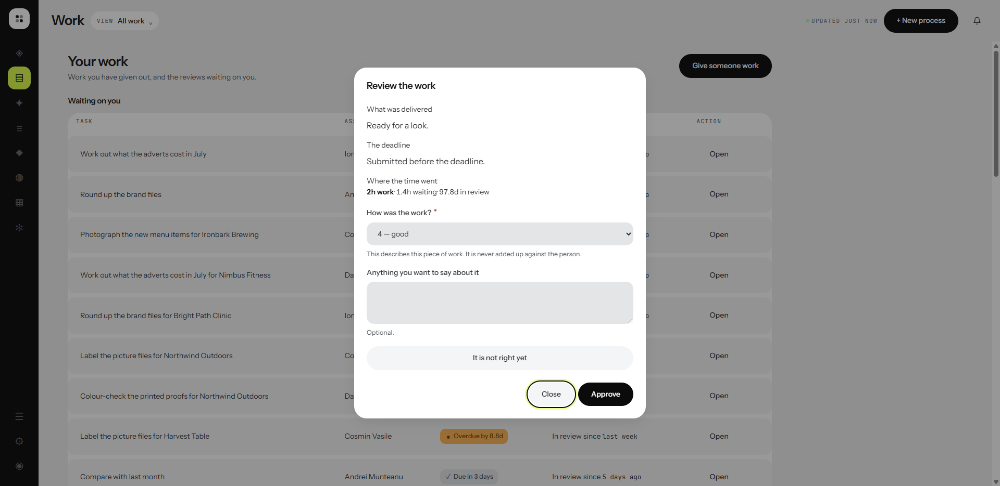

The reviewer sees what was delivered, whether it beat the deadline, and where the time went before
being asked for a judgement. The rating carries a sentence that is a design position, not a
disclaimer:

> *This describes this piece of work. It is never added up against the person.*

That line is enforced upstream of the UI. The scope test every feature is measured against asks
whether it helps a business discover, document or run a process **without ever producing a number
about a person**. A per-person score would fail it.

</details>

<details>
<summary><b>4 · Processes, as templates and as runs</b></summary>

<br>

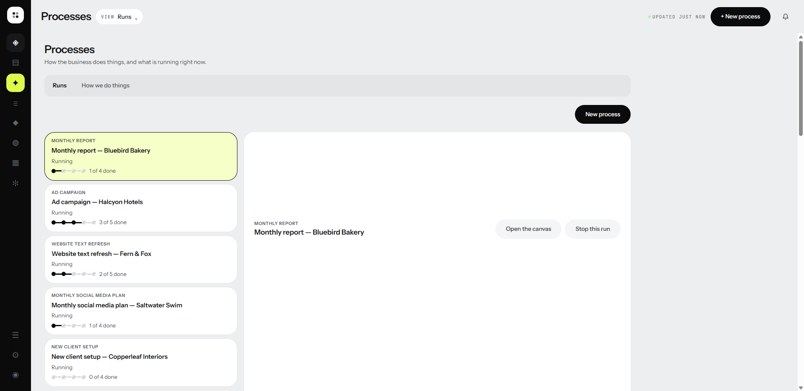

A **template** is how the business says it does something. A **run** is one attempt at it. They are
separate tables on purpose: editing the template must not rewrite the history of runs that already
happened, and a run must not drift silently away from the template it claims to follow.

<br>

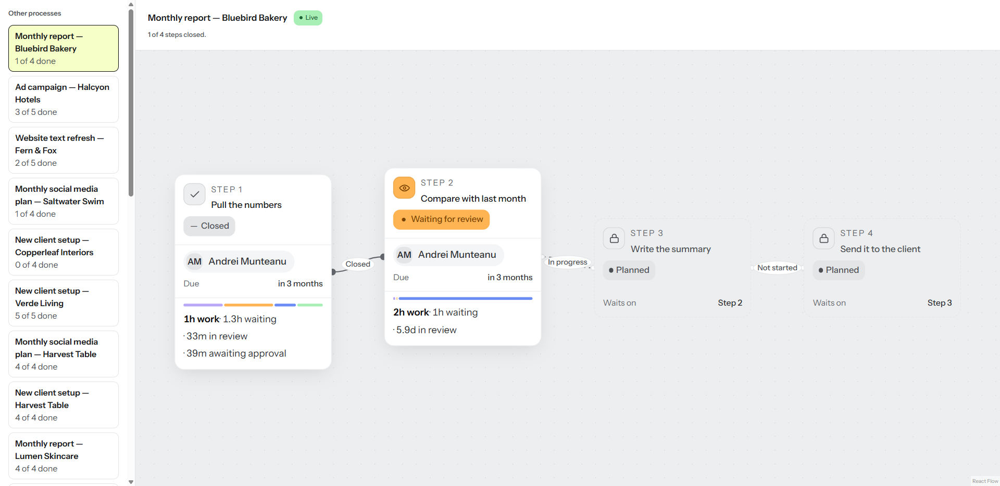

On the canvas each step carries a phase bar — `1h work · 1.3h waiting · 33m in review · 39m awaiting
approval`. Four separate measurements, because "this step took two days" is the number that hides the
problem and these four are the numbers that name it.

</details>

<details>
<summary><b>5 · The library, and what it remembers</b></summary>

<br>

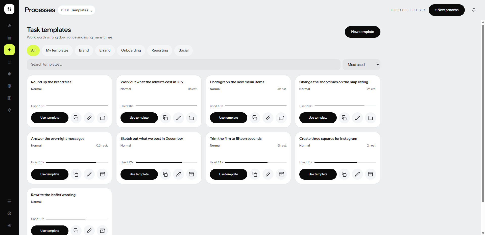

Every template carries how many times it has been used and what it usually costs. `Used 16×`,
`9h est.` The count is not decoration — it is the denominator behind *"this work has been done 16
times"* on the task record, and a template used once is a different kind of claim from one used
sixteen times.

</details>

<details>
<summary><b>6 · The observing zone</b></summary>

<br>

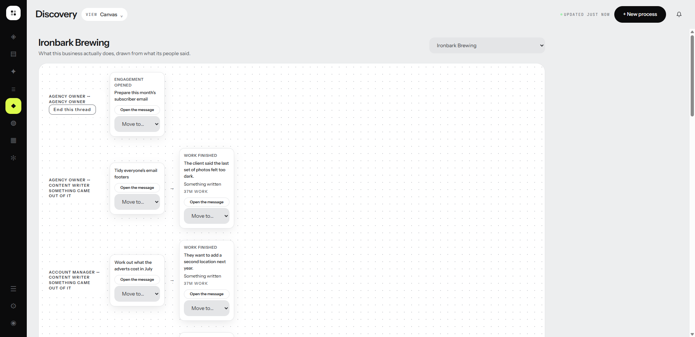

Marked work, grouped by the pair of roles that performed it — `AGENCY OWNER → CONTENT WRITER` — with
each node showing what it came from and where it can move next.

<br>

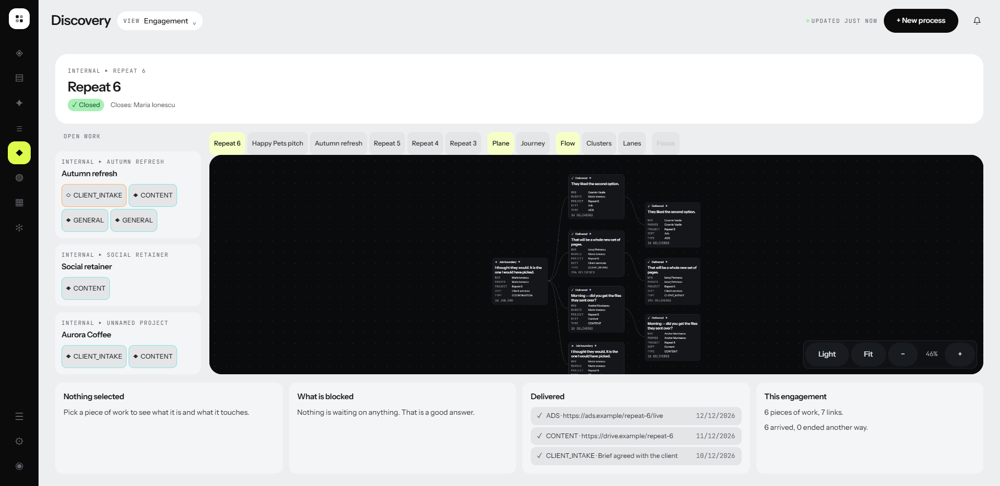

Six layouts over the same graph — Plane, Journey, Flow, Clusters, Lanes, Focus. They are not
decoration: a question about *sequence* and a question about *who is overloaded* want different
pictures of identical data.

Note the empty state, which says something true rather than something reassuring: *"Nothing is
waiting on anything. That is a good answer."*

</details>

<details>
<summary><b>7 · Reports</b></summary>

<br>

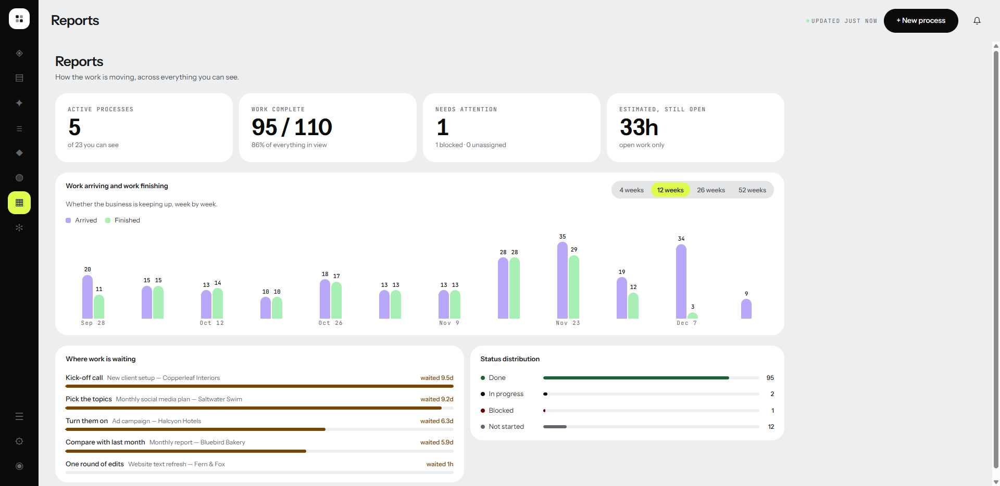

Arrivals against completions, week by week — whether the business is keeping up. Then the list that
matters most and is hardest to get from anywhere else: **where work is waiting**, longest first, each
with the run it belongs to. `Kick-off call — New client setup — Copperleaf Interiors · waited 9.5d`.

</details>

---

## Architecture

<div align="center">
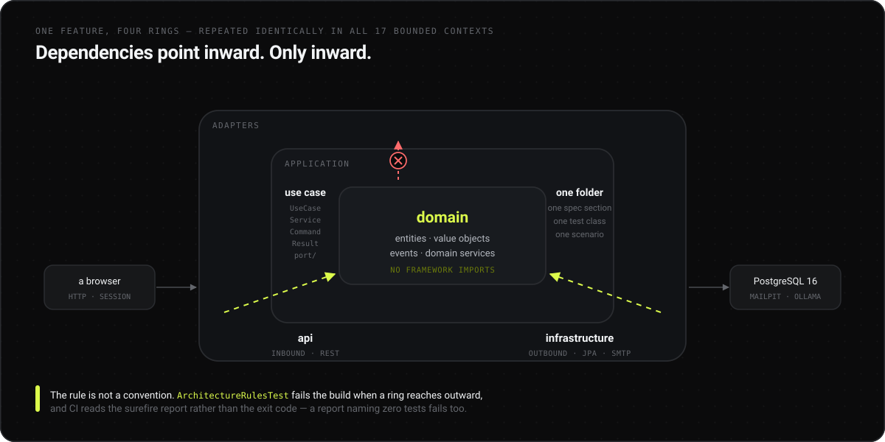
</div>

Seventeen bounded contexts, each with the identical four-ring shape. Open any feature and the rings
are in the same places.

```
com.flowops.task/
├── domain/                     enterprise rules · plain Java · no framework imports
│   ├── model/                  Task · TaskId · PhaseTimers
│   ├── enums/                  TaskState · Priority · Severity
│   ├── event/                  TaskAccepted · TaskBlocked
│   ├── exception/              IllegalTransition · TaskNotFound
│   └── service/                rules spanning more than one entity
│
├── application/                one package PER USE CASE
│   └── accepttask/
│       ├── AcceptTaskUseCase   the input port
│       ├── AcceptTaskService   the interactor
│       ├── AcceptTaskCommand   input model
│       ├── AcceptTaskResult    output model
│       └── port/               the out-ports this use case needs
│
├── api/                        inbound adapter · controllers · DTOs · mappers
└── infrastructure/             outbound adapter · JPA entities · repositories · config
```

**One use case is one folder, one spec section, one test class, one business scenario.** Finding the
tests for a behaviour means finding its folder. There is no hunting.

**Mappers appear at two rings deliberately.** `api/mapper` translates between wire DTOs and use-case
models; `infrastructure/persistence/mapper` translates between domain objects and JPA entities. The
web shape and the database shape evolve independently and neither is allowed to leak into the domain.
A single shared mapper would couple them, which is why there isn't one.

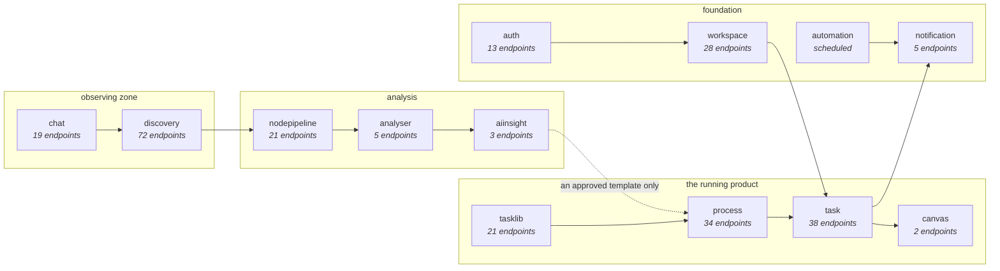
```mermaid
flowchart LR
    subgraph observe["observing zone"]
        chat["chat<br/><i>19 endpoints</i>"]
        discovery["discovery<br/><i>72 endpoints</i>"]
    end

    subgraph analyse["analysis"]
        nodepipeline["nodepipeline<br/><i>21 endpoints</i>"]
        analyser["analyser<br/><i>5 endpoints</i>"]
        aiinsight["aiinsight<br/><i>3 endpoints</i>"]
    end

    subgraph run["the running product"]
        process["process<br/><i>34 endpoints</i>"]
        task["task<br/><i>38 endpoints</i>"]
        tasklib["tasklib<br/><i>21 endpoints</i>"]
        canvas["canvas<br/><i>2 endpoints</i>"]
    end

    subgraph base["foundation"]
        auth["auth<br/><i>13 endpoints</i>"]
        workspace["workspace<br/><i>28 endpoints</i>"]
        notification["notification<br/><i>5 endpoints</i>"]
        automation["automation<br/><i>scheduled</i>"]
    end

    chat --> discovery
    discovery --> nodepipeline
    nodepipeline --> analyser
    analyser --> aiinsight
    aiinsight -.->|"an approved template only"| process
    process --> task
    tasklib --> process
    task --> canvas
    auth --> workspace
    workspace --> task
    task --> notification
    automation --> notification

    classDef zone fill:#111316,stroke:#2a2c30,color:#f2f4f6
    classDef crossing stroke:#dcfb4b,stroke-width:2px
```

The dotted edge is the only crossing from the observing zone into the running product, and it carries
one thing: an approved template. Nothing else gets through. The observing zone is not a second task
engine.

<details>
<summary><b>The frontend does not mirror the backend, and that was a decision</b></summary>

<br>

Porting ports and interactors into what is largely rendering and server-state caching buys ceremony
rather than protection. What the frontend does share is the part that matters — a stated dependency
direction and mechanical enforcement of it.

```
app/frontend/src/
├── app/            composition root · locale-prefixed routing · layout · providers
├── features/       one folder per feature, named as the backend feature is named
│   └── auth/
│       ├── api/          the calls this feature makes, on the shared client
│       ├── model/        types, schemas, the feature's rules — no rendering
│       ├── hooks/        server state and behaviour
│       ├── components/   rendering only
│       ├── routes/       the screens this feature contributes
│       └── index         the public surface; everything else is private
├── shared/         the one HTTP client · the one SSE client · UI primitives
└── i18n/           English resources, keys namespaced by feature
```

**The rule:** `app` may import from `features` and `shared`. A feature may import from `shared`.
`shared` imports from nothing above it. No feature imports another feature's internals — where two
features must meet, they meet in `app`, or the shared thing moves to `shared`.

**Where logic lives:** components render and dispatch. Anything that decides, derives, validates or
transforms belongs in `hooks` or `model`. The test is whether a rule can be tested without rendering.
If it cannot, it is in the wrong place.

These are lint boundary rules in the pipeline, not conventions. A violation blocks the merge exactly
as an architecture-test failure does, and for the same reason: an unenforced structural rule decays
silently.

</details>

---

## The data model

<div align="center">
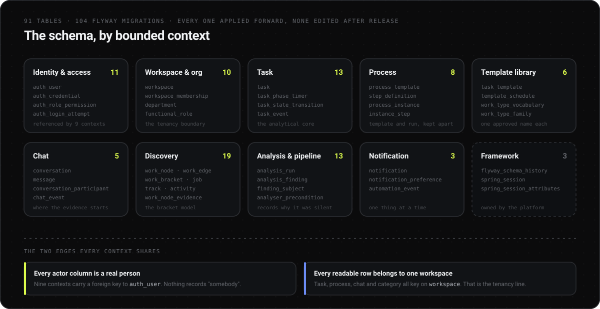
</div>

104 Flyway migrations, applied forward, none edited after release. Two edges are shared by every
context: an actor column is always a real `auth_user`, and every readable row belongs to exactly one
`workspace`.

### The task, and why it has thirteen tables

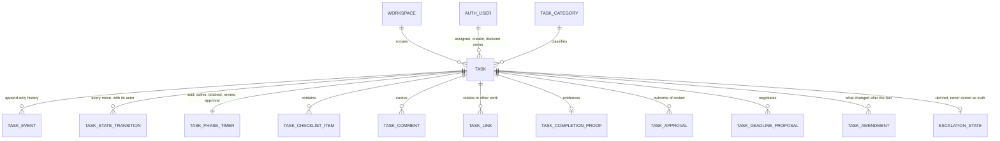
```mermaid
erDiagram
    WORKSPACE ||--o{ TASK : scopes
    AUTH_USER ||--o{ TASK : "assignee, creator, decision owner"
    TASK_CATEGORY ||--o{ TASK : classifies

    TASK ||--o{ TASK_EVENT : "append-only history"
    TASK ||--o{ TASK_STATE_TRANSITION : "every move, with its actor"
    TASK ||--|| TASK_PHASE_TIMER : "wait, active, blocked, review, approval"
    TASK ||--o{ TASK_CHECKLIST_ITEM : contains
    TASK ||--o{ TASK_COMMENT : carries
    TASK ||--o{ TASK_LINK : "relates to other work"
    TASK ||--o| TASK_COMPLETION_PROOF : evidences
    TASK ||--o{ TASK_APPROVAL : "outcome of review"
    TASK ||--o{ TASK_DEADLINE_PROPOSAL : negotiates
    TASK ||--o{ TASK_AMENDMENT : "what changed after the fact"
    TASK ||--o| ESCALATION_STATE : "derived, never stored as truth"
```

`TASK_PHASE_TIMER` is the table that makes the product's analytics possible. Wait, active, blocked,
review and approval are **discrete fields**, so "how long did this take, excluding the four days it sat
blocked on a client" is a subtraction rather than a parse of an event stream.

`ESCALATION_STATE` is derived. A task is at risk because of facts about it, not because somebody set a
flag — a stored flag goes stale the moment the deadline moves, and then lies quietly.

### Discovery — the largest context

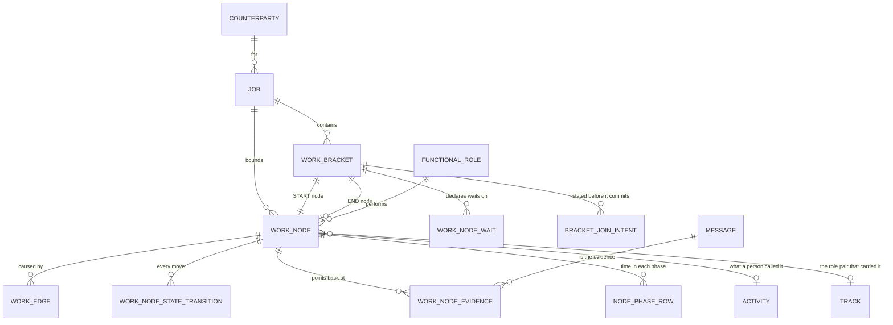
```mermaid
erDiagram
    JOB ||--o{ WORK_BRACKET : contains
    JOB ||--o{ WORK_NODE : bounds
    COUNTERPARTY ||--o{ JOB : for

    WORK_BRACKET ||--|| WORK_NODE : "START node"
    WORK_BRACKET ||--o| WORK_NODE : "END node"
    WORK_BRACKET ||--o{ WORK_NODE_WAIT : "declares waits on"
    WORK_BRACKET ||--o{ BRACKET_JOIN_INTENT : "stated before it commits"

    WORK_NODE ||--o{ WORK_EDGE : "caused by"
    WORK_NODE ||--o{ WORK_NODE_STATE_TRANSITION : "every move"
    WORK_NODE ||--o{ WORK_NODE_EVIDENCE : "points back at"
    WORK_NODE ||--o{ NODE_PHASE_ROW : "time in each phase"
    WORK_NODE }o--o| ACTIVITY : "what a person called it"
    WORK_NODE }o--o| TRACK : "the role pair that carried it"

    MESSAGE ||--o{ WORK_NODE_EVIDENCE : "is the evidence"
    FUNCTIONAL_ROLE ||--o{ WORK_NODE : performs
```

`WORK_NODE_EVIDENCE` is the join that keeps the whole product honest. Every node points back at the
chat message it was derived from, so no finding is ever unfalsifiable — click it and you read the
sentence somebody actually typed.

<details>
<summary><b>Identity, access, and the permission model</b></summary>

<br>

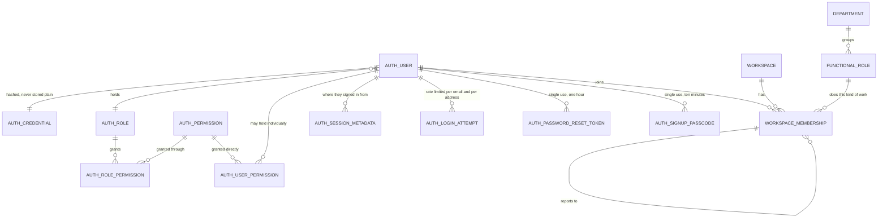
```mermaid
erDiagram
    AUTH_USER ||--|| AUTH_CREDENTIAL : "hashed, never stored plain"
    AUTH_USER }o--|| AUTH_ROLE : holds
    AUTH_ROLE ||--o{ AUTH_ROLE_PERMISSION : grants
    AUTH_PERMISSION ||--o{ AUTH_ROLE_PERMISSION : "granted through"
    AUTH_PERMISSION ||--o{ AUTH_USER_PERMISSION : "granted directly"
    AUTH_USER ||--o{ AUTH_USER_PERMISSION : "may hold individually"
    AUTH_USER ||--o{ AUTH_SESSION_METADATA : "where they signed in from"
    AUTH_USER ||--o{ AUTH_LOGIN_ATTEMPT : "rate limited per email and per address"
    AUTH_USER ||--o{ AUTH_PASSWORD_RESET_TOKEN : "single use, one hour"
    AUTH_USER ||--o{ AUTH_SIGNUP_PASSCODE : "single use, ten minutes"

    WORKSPACE ||--o{ WORKSPACE_MEMBERSHIP : has
    AUTH_USER ||--o{ WORKSPACE_MEMBERSHIP : joins
    WORKSPACE_MEMBERSHIP ||--o{ WORKSPACE_MEMBERSHIP : "reports to"
    FUNCTIONAL_ROLE ||--o{ WORKSPACE_MEMBERSHIP : "does this kind of work"
    DEPARTMENT ||--o{ FUNCTIONAL_ROLE : groups
```

Permissions are granted through a role and, where a person genuinely needs one thing nobody else in
their role needs, directly. Both paths exist because collapsing them means inventing a role per
exception, and a role that describes one person is not a role.

**Signup closes once an owner exists.** A second attempt receives the same accepted response the first
did and no passcode is ever sent. Telling the caller *"this installation is already claimed"* would
confirm the installation exists to somebody who was guessing.

</details>

<details>
<summary><b>The analysis tables, and the ones that record silence</b></summary>

<br>

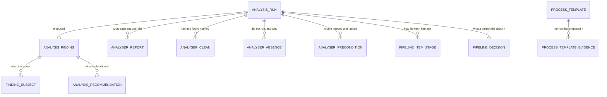
```mermaid
erDiagram
    ANALYSIS_RUN ||--o{ ANALYSIS_FINDING : produced
    ANALYSIS_RUN ||--o{ ANALYSER_REPORT : "what each analyser did"
    ANALYSIS_RUN ||--o{ ANALYSER_CLEAN : "ran and found nothing"
    ANALYSIS_RUN ||--o{ ANALYSER_ABSENCE : "did not run, and why"
    ANALYSIS_RUN ||--o{ ANALYSER_PRECONDITION : "what it needed and lacked"
    ANALYSIS_RUN ||--o{ PIPELINE_ITEM_STAGE : "how far each item got"
    ANALYSIS_FINDING ||--o{ FINDING_SUBJECT : "what it is about"
    ANALYSIS_FINDING ||--o{ ANALYSIS_RECOMMENDATION : "what to do about it"
    ANALYSIS_RUN ||--o{ PIPELINE_DECISION : "what a person did about it"
    PROCESS_TEMPLATE ||--o{ PROCESS_TEMPLATE_EVIDENCE : "the run that proposed it"
```

Four of these tables exist to record things that did **not** happen. `ANALYSER_CLEAN` is an analyser
that ran and found nothing — an answer, not a failure. `ANALYSER_ABSENCE` is one that never ran.
`ANALYSER_PRECONDITION` names exactly what a blocked analyser needed and did not have.

Without them, a quiet analyser and a broken one look identical on the board, and the first time that
matters is the day somebody trusts an empty result.

</details>

<details>
<summary><b>Process, and the separation of template from run</b></summary>

<br>

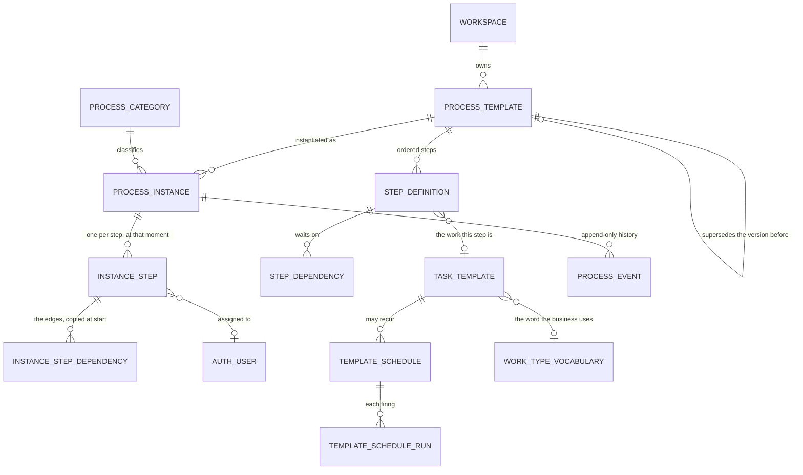
```mermaid
erDiagram
    WORKSPACE ||--o{ PROCESS_TEMPLATE : owns
    PROCESS_TEMPLATE ||--o{ STEP_DEFINITION : "ordered steps"
    STEP_DEFINITION }o--o| TASK_TEMPLATE : "the work this step is"
    STEP_DEFINITION ||--o{ STEP_DEPENDENCY : "waits on"
    PROCESS_TEMPLATE ||--o| PROCESS_TEMPLATE : "supersedes the version before"

    PROCESS_TEMPLATE ||--o{ PROCESS_INSTANCE : "instantiated as"
    PROCESS_INSTANCE ||--o{ INSTANCE_STEP : "one per step, at that moment"
    INSTANCE_STEP ||--o{ INSTANCE_STEP_DEPENDENCY : "the edges, copied at start"
    INSTANCE_STEP }o--o| AUTH_USER : "assigned to"
    PROCESS_INSTANCE ||--o{ PROCESS_EVENT : "append-only history"
    PROCESS_CATEGORY ||--o{ PROCESS_INSTANCE : classifies

    TASK_TEMPLATE ||--o{ TEMPLATE_SCHEDULE : "may recur"
    TEMPLATE_SCHEDULE ||--o{ TEMPLATE_SCHEDULE_RUN : "each firing"
    TASK_TEMPLATE }o--o| WORK_TYPE_VOCABULARY : "the word the business uses"
```

`INSTANCE_STEP_DEPENDENCY` copies the template's edges at the moment the run starts. Reading them
live from the template would mean editing a template silently rewrites what a run in flight is waiting
for — and a run whose dependencies changed under it is a run whose history is fiction.

</details>

---

## The analysis pipeline

<div align="center">
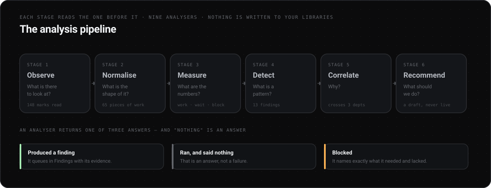
</div>

Three passes, nine analysers, six stages. Each stage reads the one before it, and **nothing the
pipeline produces is written to your libraries** — it proposes, a person disposes.

<div align="center">
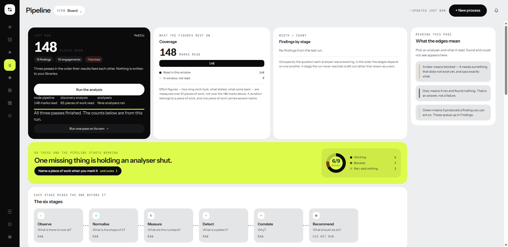
<br>
<sub><b>A real run.</b> 148 marks read, 65 pieces of work, nine analysers, 13 findings. Six analysers working, one blocked, two that ran and said nothing.</sub>
</div>

The volt band is the only saturated element on the page, and it is spending that attention on the one
sentence that changes what the reader should do next: **one missing thing is holding an analyser
shut**, with the action that unblocks it and the count of what it would unblock.

A dashboard that highlights everything highlights nothing. The design system permits exactly one
volt-filled element and one ink-900 surface per viewport, and this page spends both deliberately.

<div align="center">
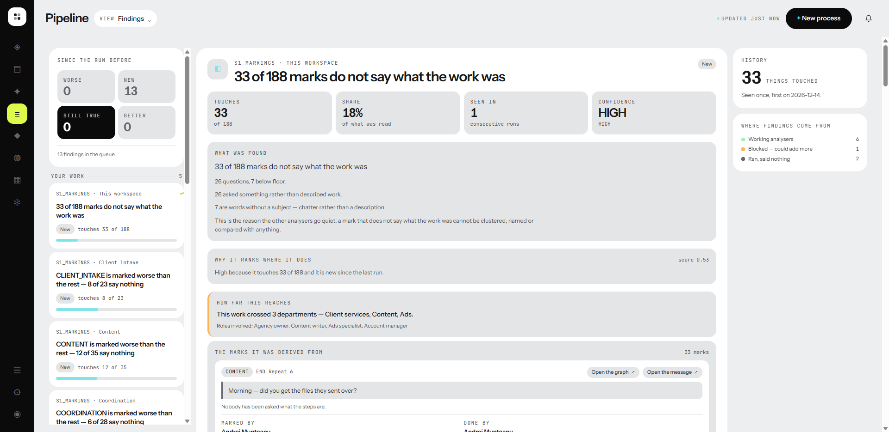
</div>

Every finding answers four questions, in this order:

1. **What was found** — *33 of 188 marks do not say what the work was*
2. **Why it ranks where it does** — `score 0.53`, high because it touches 33 of 188 and is new since the last run
3. **How far it reaches** — across 3 departments, 4 roles, named individually
4. **What it rests on** — the 33 marks themselves, each openable as the message somebody typed

The fourth is the one that matters. A finding you cannot drill into is an assertion, and an assertion
from a machine about how your business works is worth nothing.

---

## The local model integration

The product ships a language model integration, and it is **off by default** — which is a constraint
rather than a preference.

```yaml
ai:
  enabled: ${FLOWOPS_AI_ENABLED:false}
  ollama-url: ${FLOWOPS_OLLAMA_URL:http://localhost:11434}
  model: ${FLOWOPS_AI_MODEL:llama3.2:3b}
  timeout-seconds: ${FLOWOPS_AI_TIMEOUT_SECONDS:45}
```

Switched off, **the switched-off product contains no code that can reach Ollama at all** — the
container never builds the adapter. This is a wiring decision rather than an `if` somebody can forget:

```java
public interface LanguageModelPort {
    boolean isAvailable();
    Optional<ShapeOpinion> readShapeOf(EvidencePacket evidence);
}
```

`NoLanguageModelAdapter` is `@ConditionalOnProperty(matchIfMissing = true)`. Every call site handles
`Optional.empty()` because that is the ordinary path, not the error path — so a model that is absent,
slow, or talking nonsense produces the same observable behaviour as one with no opinion.

Four capabilities use it, and each is grounded in evidence the model did not generate:

| Module | What it does | What happens without a model |
|---|---|---|
| `aiassist` | Suggests the shape of a piece of work from its evidence | The suggestion is absent; the form is filled by hand |
| `aiinsight` | Turns findings into readable guidance | The findings are still there, with their numbers |
| `chatassist` | Asks whether a message describes work | The mark is made by hand, as it always could be |
| `aiexport` | Writes a handbook from what was discovered | Export is unavailable; the shapes are still on screen |

Three things are true of all four. It runs **locally** on Ollama, so nothing leaves the machine. It
**says so on every card** it writes, so no reader mistakes a generated sentence for a measured one.
And it never decides anything — every artefact it touches is a draft a person approves.

---

## The API surface

265 endpoints across 17 bounded contexts. Every one carries OpenAPI annotations naming its use-case
ID, all response statuses including errors, and the permission required.

| Context | Endpoints | Controllers | What it owns |
|---|:--:|:--:|---|
| `discovery` | 72 | 11 | The observing zone — jobs, brackets, nodes, edges, tracks, activities |
| `task` | 38 | 2 | The task lifecycle, phase timers, review and approval |
| `process` | 34 | 3 | Templates, step definitions, runs, instance steps |
| `workspace` | 28 | 2 | Tenancy, membership, invitations, departments, settings |
| `nodepipeline` | 21 | 8 | Pipeline runs, stages, findings, decisions |
| `tasklib` | 21 | 2 | The template library, schedules, work-type vocabulary |
| `chat` | 19 | 1 | Conversations, messages, marks, channels |
| `auth` | 13 | 2 | Signup, login, logout, reset, sessions |
| `analyser` | 5 | 1 | The nine analysers and their reports |
| `notification` | 5 | 1 | Notices and delivery preferences |
| `aiinsight` | 3 | 1 | Guidance drawn from findings |
| `canvas` | 2 | 1 | The canvas projection and its event stream |
| `aiexport` | 2 | 1 | Handbook export |
| `aiassist` | 1 | 1 | Grounded shape suggestion |
| `chatassist` | 1 | 1 | Does this message describe work? |
| `automation` | — | — | Scheduled: thresholds, lapses, escalations |
| `shared` | — | — | The error envelope, security, sessions, time |

Every endpoint also has a request in `app/backend/http/` — 26 `.http` files, runnable from the IDE
against a local instance. Swagger UI is at `/swagger-ui.html` when the backend is up.

<details>
<summary><b>What a request actually meets</b></summary>

<br>

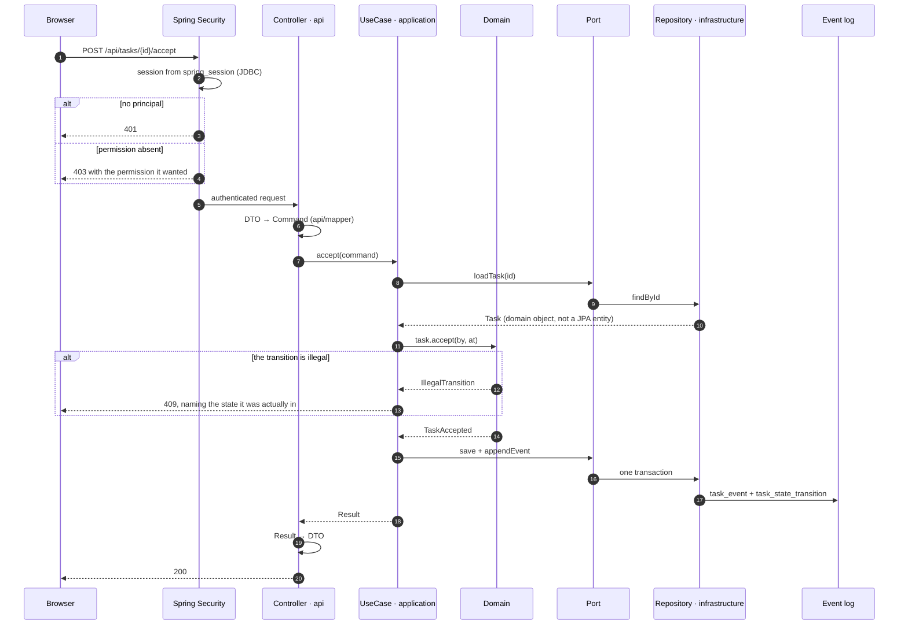
```mermaid
sequenceDiagram
    autonumber
    participant B as Browser
    participant S as Spring Security
    participant C as Controller · api
    participant U as UseCase · application
    participant D as Domain
    participant P as Port
    participant R as Repository · infrastructure
    participant E as Event log

    B->>S: POST /api/tasks/{id}/accept
    S->>S: session from spring_session (JDBC)
    alt no principal
        S-->>B: 401
    else permission absent
        S-->>B: 403 with the permission it wanted
    end
    S->>C: authenticated request
    C->>C: DTO → Command (api/mapper)
    C->>U: accept(command)
    U->>P: loadTask(id)
    P->>R: findById
    R-->>U: Task (domain object, not a JPA entity)
    U->>D: task.accept(by, at)
    alt the transition is illegal
        D-->>U: IllegalTransition
        U-->>B: 409, naming the state it was actually in
    end
    D-->>U: TaskAccepted
    U->>P: save + appendEvent
    P->>R: one transaction
    R->>E: task_event + task_state_transition
    U-->>C: Result
    C->>C: Result → DTO
    C-->>B: 200
```

State and event are written in **one transaction**. A task that moved without its event is a task
whose history is wrong, and the integration test for every transition asserts both rows or neither.

</details>

---

## Testing and the merge gates

| | Count |
|---|---|
| Backend test files | 330 |
| Frontend test files | 176 |
| Backend source files | 1,806 |
| Frontend source files | 565 |

Tests mirror the package tree exactly, so a behaviour's test sits where the behaviour lives. Every
application test is tagged with its use-case ID.

```
app/backend/src/test/java/com/flowops/
├── task/
│   ├── domain/model/TaskTest                  unit · pure rules, state-machine legality
│   ├── application/accepttask/
│   │   └── AcceptTaskServiceTest              unit · ports mocked, tagged with the use-case ID
│   ├── api/TaskControllerTest                 slice · web layer and contract shape
│   └── integration/AcceptTaskIntegrationTest  full · real PostgreSQL in Testcontainers
└── architecture/ArchitectureRulesTest         the dependency rules, as executable tests
```

**Every HTTP endpoint has a full-stack round-trip test.** An endpoint without one is not done.

### The gates that block a merge

Four of them are bespoke scripts rather than an off-the-shelf linter, and each one exists because a
defect reached the tree past everything that was already watching.

<details>
<summary><b>Every permission gate names a permission that exists</b></summary>

<br>

A control gated on a permission the backend never grants is unreachable for everybody, and a test that
passes the same invented name agrees with the bug instead of catching it.

That is not hypothetical. `TemplateScreen` shipped gated on `PROCESS_AUTHOR`, which is granted to
nobody — so the one screen that authors a process could not author a process. Nine tests were green.
Both sides are string literals, so `tsc` cannot help. The gate cross-references every gate string in
the frontend against the permissions the backend actually grants.

</details>

<details>
<summary><b>Every disjunctive permission has a possible witness</b></summary>

<br>

A permission written as a disjunction has been under-proven three times out of three on this project,
and never by a test that failed. A disjunction short-circuits, so the second term is evaluated only on
paths the first term already rejected — and if no such caller can exist, the second term decides
nothing while coverage shows the line green.

The gate asks a mechanical question: could a caller who fails the first term exist at all? If not, the
disjunction is decoration and the build says so.

</details>

<details>
<summary><b>The stream's heartbeat and the client's patience still agree</b></summary>

<br>

The server's heartbeat interval and the client's timeout are one number living in two places. Drift
between them produces no error, no exception and no failing test. It announces itself as every working
board reporting *offline* on a schedule, until people stop reading the badge.

A comment beside each number was already tried, twice, and was insufficient both times. So it is a
gate.

</details>

<details>
<summary><b>Every test file actually ran</b></summary>

<br>

Not `npm test`. Vitest reports a total it computed about itself, and it has twice collected fewer files
than exist while printing a passing summary — the second time without even setting a non-zero exit.

The gate runs the suite and then checks its count against `find`, which is a source that can disagree
with it. The two suites are counted separately, because the jsdom run excludes the browser files by
design and one total over everything on disk would report a correct skip as a missing file.

The same principle governs the architecture-rules gate: it reads `target/surefire-reports` rather than
trusting an exit code, and a report naming **zero** tests fails — because "no failures" is satisfied by
having checked nothing.

</details>

Alongside them: **Spotless** (Palantir format), **Checkstyle**, **JaCoCo** coverage published as a
trend and never gated as a number, **ArchUnit**, **gitleaks**, **Semgrep** (`p/java`, `p/typescript`),
**OWASP dependency-check** on a weekly schedule, and an `npm audit` allowlist where every accepted
advisory carries its reason — and is removed when it stops applying, so the list stays a list of
decisions rather than a list of things that were once true.

There are also 11 data gates (`scripts/gates.sql`) asserting the seeded corpus is coherent:

```
GATE                                          POPULATION  VIOLATIONS   VERDICT
──────────────────────────────────────────────────────────────────────────────
a run remembers which work each step is              100           0   PASS
closed work has a closed active phase                287           0   PASS
every run instantiates a process template             23           0   PASS
every step definition names its work                  22           0   PASS
no task exists without its template                  387           0   PASS
no task template is stuck in limbo                    63           0   PASS
nothing still running has been archived               23           0   PASS
people and reporting tree                              7           0   PASS
process tasks carry their template                    90           0   PASS
some work is shared across three processes            20           0   PASS
times_used counts every stamp                         62           0   PASS
```

---

## Technical decisions, and what they cost

<details>
<summary><b>PostgreSQL over a graph database, for a product whose centrepiece is a graph</b></summary>

<br>

The discovery graph is a genuine graph, and the obvious answer is Neo4j. It was rejected.

The graph is small and bounded — one job's nodes, never a traversal across the whole corpus. No query
in the product is deeper than a bracket's chain. What the product does constantly is *join the graph
to everything else*: a node to the message that evidences it, to the person who performed it, to the
department they sit in, to the template the shape became. In Postgres that is a join. Across two
stores it is application-level assembly with no transaction around it.

**What it cost:** `work_edge` is an edge table with the traversal written by hand, and a deep recursive
query would be awkward. That trade holds while jobs stay small, and the moment a single job has
thousands of nodes it should be revisited.

</details>

<details>
<summary><b>Server-rendered permissions, checked twice</b></summary>

<br>

The frontend hides controls a person cannot use, and the backend refuses the call anyway. The duplication
is deliberate: the frontend check is a courtesy, the backend check is the security boundary.

The failure mode this creates is the two disagreeing — a hidden control the backend would have allowed,
or worse, a visible one it refuses. Which is exactly why the permission-name gate exists, and why it is
a build failure rather than a code-review item.

</details>

<details>
<summary><b>Spring Session in JDBC, not in memory</b></summary>

<br>

Sessions live in `spring_session`, so a backend restart does not sign everybody out and a second
instance needs no sticky routing. The cost is a database round trip per request and two tables the
schema does not otherwise want.

The alternative — a JWT the client holds — was rejected because logout has to mean something. A token
that cannot be revoked before it expires means "sign out" is a client-side deletion and a lie.

</details>

<details>
<summary><b>Mail defaults to a trap on this machine</b></summary>

<br>

Every mail default points at Mailpit: no credentials, no authentication, no transport security,
because there is no network hop to secure. Development must not be able to write to a real person by
accident.

Pointing at a real server is configuration rather than a code change. The moment `FLOWOPS_MAIL_AUTH`
is true, messages leave the machine.

`FLOWOPS_APP_ORIGIN` is stated in configuration and never inferred from a request header, because a
link built from a header is a host-header injection. It is also **one** variable rather than one per
link: the invitation origin and the reset origin were once separate, both said `5173`, and on a machine
where the dev server had moved to `5174` every invitation carried a link to a port with nothing behind
it. The token stayed valid for six more days while the person clicking it met a dead page.

</details>

<details>
<summary><b>Derived state is computed, never stored</b></summary>

<br>

`ESCALATION_STATE` and the at-risk flag are derived from the task's own facts. A stored flag is correct
at the instant it is written and goes stale the moment a deadline moves — and a stale flag does not
announce itself, it just quietly stops being true.

The cost is computing it on read. The benefit is that it cannot disagree with the data it summarises.

</details>

<details>
<summary><b>English only, since the product ships in one language</b></summary>

<br>

The interface is English throughout, with keys namespaced by feature and resolved through i18next —
so the machinery for a second language is present and unused.

The fixtures are deliberately Romanian: Maria at `atelier.ro`, Andrei Munteanu, Aurora Coffee. The
interface's language and the business's are different things, and a Romanian studio using an English
tool is the product's actual situation rather than an oversight.

</details>

<details>
<summary><b>Five corrected design tokens, and why the source was overruled</b></summary>

<br>

The design system is Volt. Five of its own tokens fail its own contrast floor, and the five are
corrected in the specification rather than in a stylesheet override.

`designTokens.test.ts` fails if a source hex is restored over a corrected one. The digest test over the
source bundle exists for the same reason: its value is not detecting change, it is recording that the
specification has actually been read against what changed.

</details>

---

## Running it

**Prerequisites:** JDK 21 (Temurin) · Node 22.22.2 · Docker with Compose v2. Maven is not needed
separately; the repository carries the wrapper.

```bash
cp .env.example .env
docker compose up -d          # postgres · mailpit · ollama
```

```bash
cd app/backend
set -a; . ../../.env; set +a  # see the note below
./mvnw spring-boot:run        # http://localhost:8081
```

> **`.env` is not read by `spring-boot:run`.** Docker Compose reads it; the Maven plugin does not. The
> `set -a` line is what loads it into the environment yourself. Without it, every variable has to be
> passed on the command line — and the one people forget is the origin the emailed links are built
> from.

```bash
cd app/frontend
npm ci
npm run dev                   # http://localhost:5173
```

Flyway applies all 104 migrations on startup, so the containers must be up first.

<details>
<summary><b>A demo installation with real history</b></summary>

<br>

```bash
bash scripts/reseed.sh --yes --keep-running
```

This drops and rebuilds the database, then **drives every task through the product's own HTTP
endpoints** — which is what makes the history real rather than manufactured. It takes a few minutes and
produces 7 people under one owner, 23 process runs (18 finished, 5 in flight), 387 tasks and 63
templates, with a history running to December.

It then runs the 11 data gates and prints the table, because a seed that refused because the workspace
was not empty looks, from the outside, exactly like a seed that worked.

Sign in as `maria@atelier.ro` / `password1234`. Mail — passcodes, invitations, resets — lands in
Mailpit at <http://localhost:8025> and never leaves the machine.

Add `--thin` for a smaller history and a faster loop, or omit `--keep-running` to have it stop the
backend when it finishes.

</details>

<details>
<summary><b>Running the tests</b></summary>

<br>

```bash
cd app/backend && ./mvnw -P full clean verify   # build · unit · integration · format · style · ArchUnit
cd app/frontend && npm run test                 # vitest, jsdom
cd app/frontend && npm run test:browser         # vitest, real Chromium via Playwright
```

`preflight.sh` refuses to start a suite beside a running Vite, vitest or JVM. This is not fussiness:
vitest spawns a worker per file and will take every core, which starves a Maven run into a timeout that
looks exactly like a broken test.

</details>

<details>
<summary><b>Switching the local model on</b></summary>

<br>

```bash
docker exec flowops-ollama ollama pull llama3.2:3b
FLOWOPS_AI_ENABLED=true ./mvnw spring-boot:run
```

2GB, answers in about eighteen seconds on a laptop. With it off, every assist surface says so plainly
and the rest of the product is unchanged.

</details>

---

## Repository layout

```
flowops/
├── app/
│   ├── backend/              Spring Boot · 17 bounded contexts · 1,806 source files
│   │   ├── src/main/resources/db/migration/    104 Flyway migrations
│   │   └── http/                               26 runnable .http request files
│   └── frontend/             React 19 · Vite · 13 feature folders
├── scripts/                  preflight · reseed · gates · suite runners
├── .github/
│   ├── workflows/            build and test · merge gates · weekly dependency scan
│   └── scripts/              the bespoke gates, each with the defect that caused it
├── docker-compose.yml        postgres · mailpit · ollama
└── .env.example              every variable, with the reason it exists
```

---

## The stack, in full

| Layer | Choice | Why this one |
|---|---|---|
| Language | Java 21 (LTS) | Records and sealed types make the domain model say what it means |
| Framework | Spring Boot 3.5 | Constructor injection and `@ConditionalOnProperty` make the AI wiring a wiring decision |
| Persistence | Spring Data JPA · PostgreSQL 16 | Partial unique indexes are what enforce one open bracket per address |
| Migrations | Flyway | 104 forward-only migrations; none edited after release |
| Sessions | Spring Session JDBC | So logout means something and a restart signs nobody out |
| API docs | springdoc-openapi · Swagger UI | Annotations live with the endpoint, never retrofitted |
| Local model | Ollama · `llama3.2:3b` | Runs on a laptop; nothing leaves the machine |
| Mail | Spring Mail → Mailpit | The default is a trap on this machine, deliberately |
| UI | React 19 · TypeScript 6 · Vite 8 | |
| Server state | TanStack Query 5 | One cache, one invalidation story |
| Graphs | React Flow 12 · dagre | Both canvases, laid out rather than hand-positioned |
| Motion | Framer Motion 13 | |
| Styling | Tailwind 4 · Volt design tokens | Five source tokens corrected for contrast, and a test that keeps them corrected |
| i18n | i18next · react-i18next | English only, keys namespaced by feature |
| Backend tests | JUnit 5 · Testcontainers · ArchUnit | Integration tests meet a real PostgreSQL |
| Frontend tests | Vitest · Testing Library · Playwright | jsdom for logic, real Chromium for the rest |
| Quality | Spotless · Checkstyle · JaCoCo · gitleaks · Semgrep · OWASP | |

---

<div align="center">
<sub>Bachelor's thesis project · Technical University of Cluj-Napoca · Faculty of Automation and Computer Science</sub>
</div>
